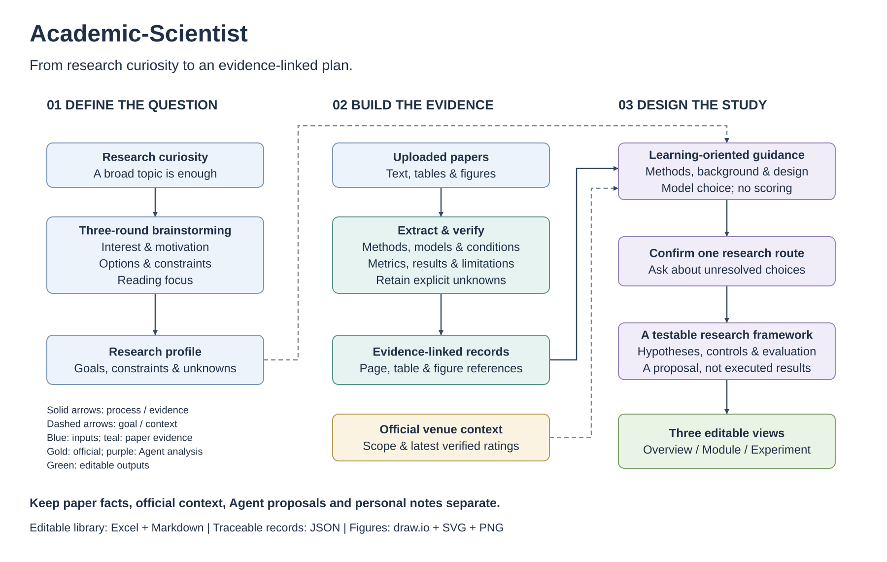

# Academic-Scientist Agent Skill

**从模糊的研究兴趣和一组论文出发，建立有证据的文献库，形成可继续修改的研究框架。**

[English](README.md) · 简体中文

**V0.1** · **适用于 Codex** · **MIT 许可证** · **调用名称 `$academic-scientist`**

[快速开始](#快速开始) · [工作流程](#工作流程) · [你会得到什么](#你会得到什么) · [运行要求](#运行要求与当前边界)

Academic-Scientist 是面向研究生和研究初学者的本地 Codex skill，帮助你明确阅读方向、理解给定文献，并逐步形成研究方案。你不必在开始时就有一个清晰的研究问题：先带着兴趣进入讨论，通过三轮真实问答确定下一步值得读什么、学什么。

> 阅读有依据，未知有记录，方案能修改。

## 它能帮你解决什么？

| 你的起点 | Skill 提供的帮助 |
|---|---|
| “我对这个领域感兴趣，但还没有具体问题。” | 三轮自适应讨论，结合你的真实回答形成研究档案，保留尚未确定的选择。 |
| “论文很多，各篇的方法和实验条件记不住。” | 结构化整理研究方法、模型来源、实验条件与结论，附原文位置和证据。 |
| “我不了解这篇论文发表的期刊或会议。” | 独立介绍发表平台的研究范围与最新可核实官方评级。 |
| “我希望随着理解深入，直接修改文献表。” | 直接编辑 Excel 事实单元格与独立笔记；事实修改回看原文核查后再合并。 |
| “这些文献对我的研究究竟有什么用？” | 从方法、背景、实验设计、模型选择说明借鉴理由，不打分、不做推荐强弱排序。 |
| “我需要一份能和导师讨论的具体框架。” | 先确认一条路线，再生成一个研究方案及三类可编辑流程图。 |

工作流既适用于计算机领域文献，也考虑材料、化学等实验信息较多的论文。没有计算模型的论文可以标记模型字段为**不适用**。

## 工作流程



[查看完整 PNG](assets/workflow.png) · [可编辑 draw.io 源文件](assets/workflow.drawio) · [PDF](assets/workflow.pdf)

这是一张产品工作流示意图，不包含研究结果。实线表示处理流程或证据使用，虚线表示研究目标或外部背景的输入。

1. **探索研究问题。** Agent 逐轮设计追问，等待你的真实回答；三轮问题根据你的经验和不确定之处调整。
2. **阅读给定文献。** 检查正文、表格与图片，记录抽取依据，以及尚不能确认的内容。
3. **补充官方平台认知。** 将期刊/会议定位与评级独立保存，记录评价体系、版本、学科和查询日期。
4. **维护可编辑文献库。** 导出阅读卡与 Excel，保留证据、编辑基线和修订历史，支持后续更新。
5. **解释值得学习什么。** 将论文证据与个人目标关联，给出借鉴理由、阅读位置与方法迁移条件。
6. **确认一条研究路线。** 遇到影响方案的未知选择先询问，再生成一个详细框架；文献已有结论与拟议设计分别表述。
7. **一次交付三类图。** 基于同一研究方案和证据，生成整体框架图、关键模块详图和实验流程图。

## 以证据为基础

四类信息分别记录，避免把推测写成论文事实：

| 信息类型 | 来源与处理方式 |
|---|---|
| **论文事实** | 仅来自你提供的论文及补充材料，保留页码、章节、表格或图编号及对应证据。 |
| **外部平台信息** | 只查官方来源，展示最新可核实版本；查不到时明确标注“尚未查阅到相关官方评级”，不使用第三方评级替代。 |
| **Agent 分析与研究方案** | 写明依据、假设、迁移条件与未知；研究方案是待验证设计。 |
| **个人笔记与修改** | 笔记独立；事实修改回看原文；有冲突先确认再合并。 |

论文抽取涵盖标题、作者、正式发表年份、期刊或会议，以及研究目的、方法、模型与来源、数据/材料、参数、带实验条件的指标、结果和局限。复现信息仅记录**文献是否声明提供代码和数据**，不等同于已验证这些资源可用。

模型来源区分：新架构或模块、已有模型结构修改、组合已有模块、微调或训练策略调整、直接使用、对照基线、依据不足。作者声称提出某项方法，不等于已独立证明其首创性。

**未报告、不适用、无法确认、尚未检查是不同状态。** 证据记录与 Agent 复核便于核查，不能保证绝对正确，也不能替代专业判断。

## 你会得到什么

| 成果 | 用途 |
|---|---|
| 研究档案 | 保存研究目标、真实回答、约束与尚未明确的问题。 |
| 逐篇论文阅读卡 | 随时回到每篇论文的结论及其证据。 |
| Excel + Markdown 文献库 | 对比文献，直接修改事实单元格，维护独立笔记。 |
| 阅读建议 | 从方法、背景、实验设计、模型选择寻找借鉴点，不进行量化评分或推荐强弱排序。 |
| 研究方案 | 讨论研究问题、假设、方法、对照、评价、最小实验与失败判据。 |
| 三类可编辑图 | 整体框架、关键模块、实验流程；提供 draw.io、SVG，渲染环境可用时提供 PNG/PDF。 |

研究项目将日常成果放在表层，将证据与状态放在内部目录：

```text
我的研究项目/
├── 阅读入口.md
├── 研究档案.md
├── 文献整理.xlsx
├── 阅读建议.md
├── 研究方案.md
├── 论文阅读卡/
├── 流程图/
└── .academic-scientist/  # 证据、状态、编辑基线与历史
```

成果随对应工作完成而出现。保留内部目录有助于中断恢复和修改核对；用户已有修改受到保护，旧研究工作区不会被自动搬迁。

## 快速开始

### 1. 获取仓库

通过 **Code → Download ZIP** 下载并解压，或使用 Git：

```powershell
git clone --config core.autocrlf=false https://github.com/Emphany-Go/Academic-Scientist-Agent-Skill.git
cd Academic-Scientist-Agent-Skill
```

克隆选项用于保留原始换行符，避免文件完整性校验受到自动转换影响。进入同时包含 `README.md`、`skills/` 和 `tools/` 的目录。使用源码包不要求仓库先创建 GitHub Release。

### 2. 检查文件并安装 skill

```powershell
python -B -X utf8 tools/self_check.py
python -B -X utf8 tools/install.py
```

本包安装器默认安装到 `~/.agents/skills/academic-scientist`。若你的客户端使用 `~/.codex/skills`，可按[安装指南](docs/INSTALL.md)选择兼容选项。遇到已有同名 skill 会停止，不覆盖旧版；选择一个安装位置即可。安装器只复制 skill 文件，不安装运行依赖。

新开一轮 Codex 对话，使用 `$academic-scientist`。如果未被识别，检查实际客户端的技能列表。

### 3. 带着兴趣和论文开始

```text
使用 $academic-scientist。
我对［研究领域］感兴趣，但还没有确定具体问题。
论文位于［论文目录］，请在［研究项目目录］中开展工作。
先检查环境，告诉我哪些能力缺少依赖。
随后逐轮开展三轮讨论，每轮等待我的真实回答。
阅读我提供的论文，保留原文依据和不确定性。
遇到会影响研究内容的未知选择，先问我。
```

研究目录应与 skill 安装目录分开。对话和成果可以按你的语言要求生成；研究图默认使用中文并保留必要英文术语，也可以明确要求英文图注。

## 后续使用示例

**更新文献表**

```text
我修改了文献整理.xlsx 中的事实单元格和笔记。
请对比导出基线与当前记录，回看给定论文核查事实修改。
有冲突的地方先问我，再合并。
```

**调整研究方向**

```text
我的研究目标改为［新方向］。
请保留已经核查的论文事实，更新研究档案，
并重新生成适合这个目标的学习理由，不打分、不排序。
```

**生成研究框架与三类图**

```text
请结合已复核文献和阅读建议，帮我明确一条研究路线。
影响方案的未知选择先问我，再生成一个详细方案。
一次交付整体框架图、关键模块详图和实验流程图。
图中文字使用英文，提供可编辑 draw.io 源文件。
区分文献证据、拟议设计和尚未验证的假设。
```

## 运行要求与当前边界

| 能力 | 所需环境 |
|---|---|
| 阅读与研究讨论 | 支持本地文件、脚本和视觉检查的 Codex；官方平台查询需要联网工具。 |
| 状态、校验与 PDF 处理 | Python 3.10+；`jsonschema`、`pypdf`、`pypdfium2`、`Pillow`。已测版本见 [requirements.txt](skills/academic-scientist/requirements.txt)。 |
| Excel 生成 | Node.js 及宿主已有的 `@oai/artifact-tool` 运行库。 |
| 图形 PNG/PDF 渲染 | Node.js、Playwright 与已有 Chrome/Chromium。 |

**安装 skill 不等于安装运行环境。** 尤其不要假定 `@oai/artifact-tool` 可通过公共 npm 安装。环境检查会报告缺项；安装缺失依赖需要你的确认。缺少 Excel 运行库时，可以继续 JSON/Markdown 工作，但无法生成新的 XLSX。

Agent 负责语义阅读和官方资料查询；脚本负责状态、校验与导出。V0.1 不执行 OCR，不自动训练模型、执行研究实验或证明新颖性；它是本地 skill 包，不是独立模型服务或已上架的 Codex 插件。

V0.1 发布时记录了 **321 项自动测试、33 项发布检查**，以及压缩包和隔离安装检查，测试环境为 Windows/Python 3.11。这些是历史发布检查，不是抽取准确率证明，也不是本轮 README 更新重新完成了全流程评测。原生 draw.io 应用操作、跨机器部署和部分用户验收场景仍未验证，详见[验证范围](VALIDATION.md)和[版本说明](docs/RELEASE_NOTES.md)。

## 仓库结构

```text
Academic-Scientist-Agent-Skill/
├── README.md / README.zh-CN.md
├── assets/                     # 英文工作流与可编辑源文件
├── skills/academic-scientist/   # 可安装 skill、脚本、Schema 与规范
├── tools/                      # 包校验与本地安装工具
├── docs/                       # 安装、发布与版本说明
├── SHA256SUMS.json             # 文件完整性清单
└── LICENSE                     # MIT
```

源码包不包含研究论文、个人问答、研究工作区、测试数据及开发日志。本轮仅更新项目展示文档，V0.1 skill 实现保持不变。配套操作文档目前为中文。

## 文档与致谢

- [安装与环境检查](docs/INSTALL.md)
- [GitHub 发布教程](docs/GITHUB.md)
- [V0.1 版本说明](docs/RELEASE_NOTES.md)
- [验证范围](VALIDATION.md)
- [参考项目与依赖说明](NOTICE.md)

项目在工作流构思上参考了 [Academic Research Agent Skill](https://github.com/ngtiendong/Academic-Research-Agent-Skill)，本 README 也借鉴其从使用场景出发展示项目的方式。此处能力说明以本仓库实际实现为准。

采用 [MIT 许可证](LICENSE)。
